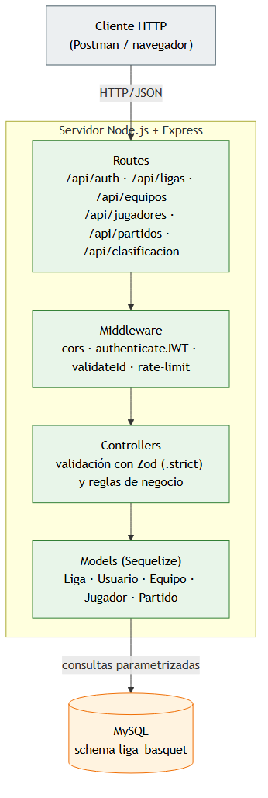
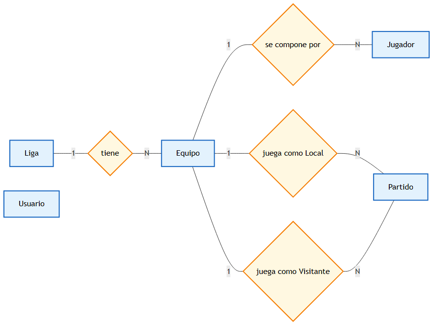
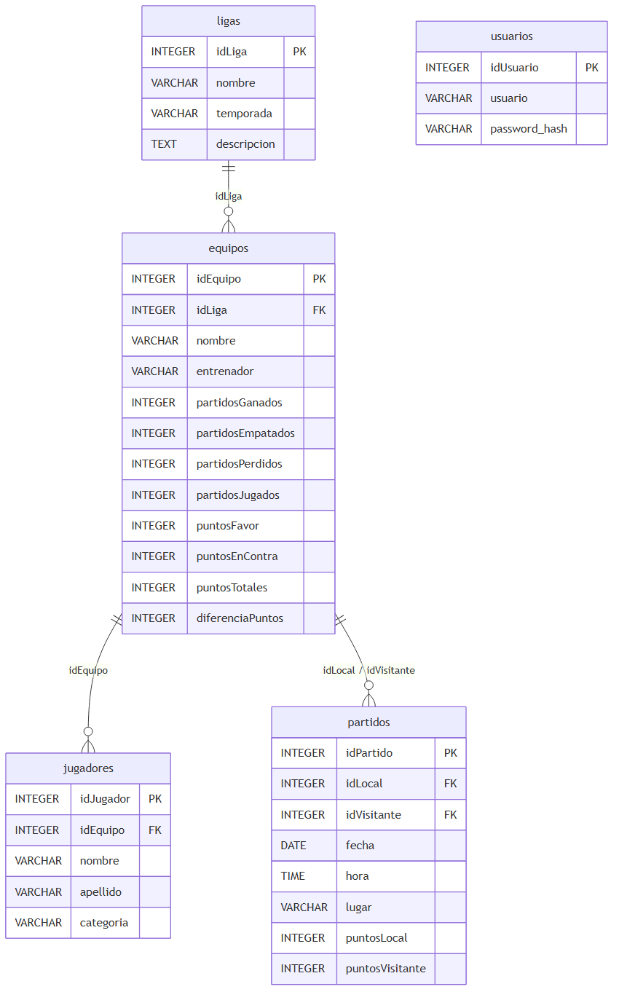
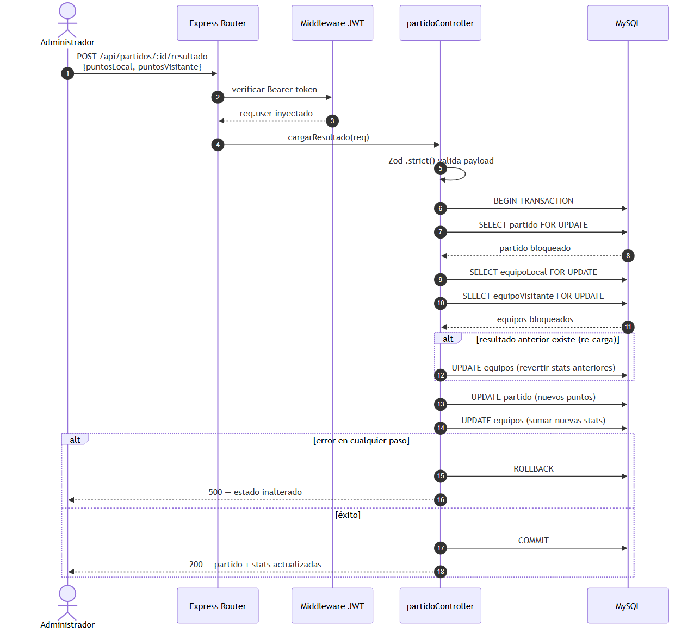

# Documentación Técnica — Sistema de Gestión de Liga de Básquet

Esta documentación describe la arquitectura, decisiones técnicas y mecanismos de seguridad implementados en el backend del sistema. El objetivo principal es justificar el diseño para asegurar consistencia, escalabilidad y protección de datos.

---

## 1. Arquitectura del Backend

El servidor se desarrolló en Node.js utilizando Express.js. Esta selección tecnológica responde a la necesidad de gestionar múltiples solicitudes concurrentes mediante el modelo de entrada/salida asíncrono no bloqueante de Node.js.

El diseño sigue el patrón de separación por capas: **modelos**, **controladores**, **rutas** y **middleware**. Este enfoque desacopla la lógica de negocio de la capa de transporte HTTP y facilita el mantenimiento del código.

### Diagrama de capas



Cada solicitud entrante atraviesa la cadena de **routing → middleware → controller → modelo → base de datos**. Las respuestas regresan por el mismo camino. Esta linealidad simplifica el seguimiento de errores y el testeo manual mediante la colección Postman provista en el repositorio.

---

## 2. Seguridad y Autenticación

El sistema restringe el acceso a las funciones administrativas mediante autenticación sin estado y criptografía. Las rutas de lectura (`GET`) sobre los recursos de catálogo son públicas; las operaciones de escritura (`POST`, `PUT`, `DELETE`) requieren un token JWT válido.

### Stack Tecnológico

- **Express.js**: provee el enrutamiento HTTP y la ejecución en cadena de middlewares.
- **Zod**: implementa validación estricta de esquemas en tiempo de ejecución. Esta validación sanitiza los payloads de entrada y mitiga vulnerabilidades por inyección de datos malformados antes de alcanzar los controladores.
- **Sequelize**: actúa como mapeador objeto-relacional frente a la base de datos MySQL. Abstrae las sentencias de consulta y previene ataques de inyección SQL de forma nativa mediante el uso interno de consultas parametrizadas.
- **mysql2**: driver utilizado por Sequelize para comunicarse con la instancia MySQL.
- **Bcryptjs y JWT**: gestionan el cifrado de credenciales y la autorización.
- **CORS**: middleware que aplica una lista blanca de orígenes permitidos, configurable mediante la variable `CORS_ORIGIN`.
- **express-rate-limit**: limita los intentos de autenticación contra el endpoint de login para mitigar ataques de fuerza bruta.
- **dotenv**: carga las variables de entorno definidas en el archivo `.env`.

### Tratamiento de Credenciales

Para evitar el almacenamiento de contraseñas en texto plano, se emplea la biblioteca **Bcryptjs** para generar un hash irreversible por cada contraseña. El algoritmo incorpora internamente un **salt**, un valor aleatorio único añadido antes de calcular el hash. La inclusión del salt mitiga ataques de precomputación mediante tablas rainbow y ataques de diccionario. Durante la autenticación, la función comparativa verifica el ingreso contra el hash almacenado incorporando protección contra ataques de tiempo.

### Flujo JSON Web Tokens

La gestión de sesiones emplea arquitectura **stateless** mediante JWT. Esto elimina la necesidad de almacenar el estado de la sesión en la memoria del servidor o en bases de datos externas de caché. Este enfoque reduce el consumo de recursos y facilita la escalabilidad horizontal.

- **Generación**: tras la validación de credenciales, el servidor emite un token firmado digitalmente con una clave privada. El token incluye una fecha de expiración estricta de **12 horas** para acotar la ventana de vulnerabilidad ante un posible robo del mismo.
- **Validación**: el middleware de autenticación intercepta las solicitudes a endpoints protegidos. Requiere la presencia de la cabecera `Authorization` bajo el estándar **RFC 6750** con el esquema `Bearer`.
- **Verificación**: el servidor recalcula la firma del token utilizando la clave secreta. Si el resultado coincide, se garantiza que el payload no sufrió alteraciones por terceros. El ID del usuario contenido en el token se inyecta en la solicitud para su procesamiento.

### Defensas adicionales

- **Rate limiting en login**: el endpoint `POST /api/auth/login` está protegido por `express-rate-limit` con un máximo de 20 intentos por dirección IP en una ventana de 15 minutos. Los intentos posteriores reciben una respuesta `429 Too Many Requests`.
- **CORS con whitelist**: solo se aceptan solicitudes provenientes de los orígenes definidos en la variable `CORS_ORIGIN`. Esto limita la exposición de la API ante orígenes no autorizados.
- **Validación de IDs en rutas**: el middleware `validateId` rechaza cualquier parámetro `:id` que no sea un entero positivo antes de que la solicitud alcance la capa de controlador, reduciendo el espectro de entradas que llegan al ORM.

---

## 3. Modelo de Datos y Persistencia

El repositorio de datos reside en MySQL. El esquema relacional aplica restricciones de clave foránea a nivel motor para garantizar la integridad estructural de la información.

### Integridad Referencial

- **Liga y Equipos**: relación uno a muchos configurada con la directiva `ON DELETE RESTRICT`. Impide eliminar una liga mientras existan equipos asociados a ella, preservando la coherencia del torneo.
- **Equipos y Jugadores**: relación uno a muchos configurada con la directiva de eliminación en cascada `ON DELETE SET NULL`. Esta configuración garantiza que, si se elimina un club de la base de datos, los registros de sus jugadores persisten en el sistema en condición de jugadores libres. Así se resguarda el historial individual del deportista.
- **Equipos y Partidos**: relación uno a muchos (Local y Visitante por separado) configurada con la directiva `ON DELETE RESTRICT`. Esta restricción impone un bloqueo e impide eliminar un equipo que posea registros en la tabla de partidos. La decisión técnica protege la integridad matemática de la tabla de posiciones y previene la corrupción del historial del torneo.

### Diagramas de Diseño

#### Diagrama Entidad-Relación (DER) — Vista conceptual

El DER expresa el modelo de dominio en notación Chen: las **entidades** se representan como rectángulos, las **relaciones** como rombos y las **cardinalidades** se etiquetan sobre las aristas. La intención de este diagrama es comunicar el modelo lógico, sin comprometerse con tipos de datos ni con la implementación física.



La entidad `Usuario` queda fuera del grafo de dominio deportivo: no participa en ninguna relación con las demás entidades, ya que su único propósito es habilitar el control de acceso al área administrativa.

#### Modelo Relacional — Vista física

El modelo relacional expresa el esquema tal como existe en MySQL. A diferencia del DER, este diagrama incluye los **tipos SQL exactos**, las **claves primarias** (`PK`) y **foráneas** (`FK`) por columna, y las relaciones se identifican explícitamente por la columna que las implementa.



---

## 4. Motor de Resultados

La carga de resultados es la operación de mayor criticidad del sistema. Su ejecución modifica múltiples registros. Una falla parcial dejaría la tabla de posiciones corrupta.

### Reglas de puntaje

| Resultado | Puntos otorgados |
|-----------|------------------|
| Partido ganado | 3 |
| Partido empatado | 1 |
| Partido perdido | 0 |

El campo `puntosTotales` de cada equipo se calcula como `PG * 3 + PE`. La `diferenciaPuntos` se actualiza con la diferencia neta entre tantos a favor y tantos en contra acumulados.

### Reglas de negocio sobre partidos

- Un partido no puede tener al mismo equipo como local y visitante.
- Un partido con resultado cargado no puede ser modificado ni eliminado mediante los endpoints de actualización general (`PUT /api/partidos/:id`) ni borrado (`DELETE`). La única vía de cambio es volver a invocar `POST /api/partidos/:id/resultado`, que reaplica la lógica de reversión y suma descripta abajo.

### Transacciones ACID y Bloqueos

El cálculo estadístico se ejecuta íntegramente dentro de una transacción de base de datos controlada por Sequelize. Esto asegura las propiedades de atomicidad, consistencia, aislamiento y durabilidad.

- **Aislamiento por bloqueo de fila**: al iniciar la transacción, el controlador ejecuta sentencias `SELECT ... FOR UPDATE` sobre los registros de los equipos local y visitante. Este bloqueo exclusivo a nivel de fila impide condiciones de carrera. Si dos usuarios intentaran modificar el mismo partido simultáneamente, las consultas de lectura en la segunda transacción quedarían en espera. Esto previene lecturas sucias y el cálculo de deltas estadísticos erróneos.
- **Idempotencia y reversión lógica**: cuando el usuario modifica un resultado previamente cargado, el algoritmo primero **resta** las estadísticas derivadas del resultado anterior en los equipos. A continuación, **suma** los valores correspondientes al nuevo resultado. Este enfoque matemático procesa la actualización sin requerir tablas de auditoría intermedias.
- **Control de errores y rollback**: si ocurre una interrupción de red o una excepción durante el cálculo, el servidor lanza la instrucción `ROLLBACK`. La transacción deshace todos los cambios pendientes y la base de datos retorna a su estado inicial seguro. Únicamente tras el éxito de la secuencia completa se ejecuta la instrucción `COMMIT`.

### Diagrama de secuencia — `POST /api/partidos/:id/resultado`



El diagrama anterior consolida visualmente las tres garantías técnicas de la sección: **bloqueo exclusivo** (pasos 7 a 10), **reversión idempotente** (paso 11, condicional), y **rollback ante fallas** (rama de error tras los UPDATEs).

---

## 5. Configuración y Despliegue del Entorno

### Requisitos del Sistema

- **Node.js**: motor de ejecución versión 18 o superior.
- **Servidor MySQL**: instancia de base de datos relacional operativa.

### Inicialización

1. Acceder al directorio del servidor (`/server`).
2. Descargar dependencias ejecutando `npm install`.
3. Copiar la plantilla `cp .env.example .env` y completar los valores requeridos (credenciales MySQL y `JWT_SECRET`). El archivo `.env.example` versionado en el repositorio documenta cada variable junto a su rol y valor por defecto.
4. Ejecutar el comando de poblamiento inicial mediante `npm run seed`.
5. Levantar el servicio en entorno de desarrollo mediante `npm run dev`.

> **Nota sobre el esquema de base de datos**: la sincronización al levantar el servidor se realiza con `sequelize.sync()`. Esta operación crea las tablas faltantes pero **no aplica cambios estructurales sobre tablas existentes** (renombrado de columnas, alteración de claves foráneas, etc.). Si la instancia de MySQL ya contiene un esquema generado por una versión anterior del proyecto, debe recrearse el schema antes de iniciar (`DROP DATABASE liga_basquet; CREATE DATABASE liga_basquet;`) para que el modelo actual quede reflejado correctamente.

### Variables de Entorno Críticas

| Variable | Descripción | Default |
|----------|-------------|---------|
| `DB_NAME` | Identificador del esquema de base de datos | — |
| `DB_USER` | Usuario MySQL | — |
| `DB_PASSWORD` | Contraseña MySQL | — |
| `DB_HOST` | Host del servidor MySQL | — |
| `DB_PORT` | Puerto MySQL | `3306` |
| `JWT_SECRET` | Cadena criptográfica compleja para la firma digital | — |
| `ADMIN_USER` | Credencial administrativa configurada durante el poblamiento inicial | `admin` |
| `ADMIN_PASSWORD` | Contraseña del usuario administrador inicial | `adminpassword` |
| `PORT` | Puerto en el que escucha el servidor Node | `3000` |
| `CORS_ORIGIN` | Lista de orígenes permitidos, separados por coma | `http://localhost:5173,http://localhost:3000` |
| `LIGA_NAME` | Nombre de la liga creada por el seed (opcional) | `Liga de Basquet Juvenil` |
| `LIGA_TEMPORADA` | Temporada de la liga seeded (opcional) | `1C 2026` |
| `LIGA_DESCRIPCION` | Descripción de la liga seeded (opcional) | `Liga oficial TPO` |

---

## 6. Entorno de Evaluación

El script de inicialización provee una base de datos preconfigurada para validación inmediata. La ejecución de `npm run seed` encadena dos scripts:

- **`seedAdmin.js`**: genera las credenciales administrativas de acceso a partir de `ADMIN_USER` y `ADMIN_PASSWORD`. Si las variables no se proveen, se emite una advertencia y se aplican valores por defecto.
- **`seedLiga.js`**: construye un contexto funcional compuesto por:
  - **Una liga** (`Liga de Basquet Juvenil`, temporada `1C 2026`).
  - **Cuatro equipos** asociados a la liga: Halcones Rojos, Tigres Azules, Águilas Doradas y Lobos Plateados, cada uno con su entrenador asignado.
  - **Cinco jugadores por equipo** (veinte en total) en categoría Juvenil.

El conjunto resultante habilita la ejecución manual de pruebas sobre los endpoints de actualización de resultados (`POST /api/partidos/:id/resultado`), facilitando la verificación del comportamiento atómico de las transacciones documentadas en la sección 4.

El script es **idempotente**: utiliza `findOrCreate` para liga, equipos y jugadores, identificando cada equipo por la combinación `(nombre, idLiga)` y cada jugador por `(nombre, apellido, idEquipo)`. Si el seed se ejecuta más de una vez sobre la misma base, no se duplican registros y la información preexistente queda intacta.

---

## 7. Credenciales de Prueba

Las credenciales del usuario administrador se generan automáticamente al ejecutar `npm run seed`. Si las variables `ADMIN_USER` y `ADMIN_PASSWORD` no están definidas en el archivo `.env`, el script aplica los siguientes valores por defecto y emite una advertencia por consola:

| Campo | Valor por defecto |
|-------|-------------------|
| Usuario | `admin` |
| Contraseña | `adminpassword` |

> **Nota de seguridad**: estas credenciales están pensadas exclusivamente para el entorno de evaluación. En un despliegue productivo deben sobrescribirse mediante variables de entorno con valores no triviales antes de ejecutar el seed.

El endpoint de autenticación es `POST /api/auth/login` y devuelve un JWT con vigencia de doce horas. El token debe incluirse en el header `Authorization: Bearer <token>` para todas las operaciones de escritura sobre los recursos protegidos.

---

## 8. Manual de Uso de la API

A continuación se describe el flujo end-to-end típico para verificar la API. Cada paso indica el método HTTP, la ruta, la autorización requerida y un ejemplo de payload.

### Paso 1 — Verificar disponibilidad

```http
GET /api/health
```

Respuesta esperada `200 OK`:
```json
{ "status": "OK", "message": "Backend funcionando correctamente" }
```

### Paso 2 — Login del administrador

```http
POST /api/auth/login
Content-Type: application/json

{ "usuario": "admin", "password": "adminpassword" }
```

Respuesta esperada `200 OK`. Guardar el campo `token` para los pasos siguientes.

### Paso 3 — Crear una liga

```http
POST /api/ligas
Authorization: Bearer <token>
Content-Type: application/json

{ "nombre": "Liga TPO", "temporada": "1C 2026", "descripcion": "Liga de prueba" }
```

Respuesta `201 Created`. Guardar el campo `idLiga`.

### Paso 4 — Crear dos equipos

```http
POST /api/equipos
Authorization: Bearer <token>
Content-Type: application/json

{ "nombre": "Halcones", "entrenador": "C. Méndez", "idLiga": 1 }
```

Repetir para un segundo equipo. Guardar `idEquipo` de cada uno.

### Paso 5 — Asociar jugadores a un equipo

```http
POST /api/jugadores
Authorization: Bearer <token>
Content-Type: application/json

{ "nombre": "Lucas", "apellido": "García", "categoria": "Juvenil", "idEquipo": 1 }
```

### Paso 6 — Programar un partido

```http
POST /api/partidos
Authorization: Bearer <token>
Content-Type: application/json

{
  "fecha": "2026-05-15",
  "hora": "19:00",
  "lugar": "Estadio Central",
  "idLocal": 1,
  "idVisitante": 2
}
```

Respuesta `201 Created`. Guardar `idPartido`.

### Paso 7 — Cargar el resultado

```http
POST /api/partidos/1/resultado
Authorization: Bearer <token>
Content-Type: application/json

{ "puntosLocal": 85, "puntosVisitante": 72 }
```

Respuesta `200 OK` con el partido actualizado y las estadísticas recalculadas de ambos equipos.

### Paso 8 — Consultar la clasificación (público)

```http
GET /api/clasificacion
```

Respuesta `200 OK`: arreglo ordenado por `puntosTotales` descendente, con desempate por `diferenciaPuntos` y luego por `tantosFavor`.

### Paso 9 — Consultar el calendario filtrado (público)

```http
GET /api/partidos?estado=pendiente
GET /api/partidos?estado=jugado
GET /api/partidos?desde=2026-05-01&hasta=2026-05-31
```

El endpoint `/api/partidos` acepta tres parámetros opcionales y combinables:

| Query | Valores válidos | Descripción |
|-------|-----------------|-------------|
| `estado` | `pendiente` \| `jugado` | Filtra partidos sin resultado (`pendiente`) o con resultado cargado (`jugado`). |
| `desde` | `YYYY-MM-DD` | Cota inferior de fecha (inclusiva). |
| `hasta` | `YYYY-MM-DD` | Cota superior de fecha (inclusiva). |

El listado se ordena cronológicamente por `fecha` y, dentro de la misma fecha, por `hora`. Cualquier valor inválido en estos parámetros provoca una respuesta `400 Bad Request` con el detalle del error de validación de Zod.

### Paso 10 — Consultar el detalle de un equipo (público)

```http
GET /api/equipos/1
```

Respuesta `200 OK` con la siguiente estructura:

- Datos del equipo (`nombre`, `entrenador`, estadísticas acumuladas `puntosTotales`, `diferenciaPuntos`, etc.).
- `Jugadors`: lista de jugadores asociados al equipo.
- `partidosLocal` y `partidosVisitante`: arreglos crudos según la condición en la que el equipo participa.
- `partidosJugados` y `partidosPendientes`: arreglos consolidados de ambas condiciones, ordenados por fecha. Cada elemento incluye un campo `condicion` (`"Local"` o `"Visitante"`) que indica el rol del equipo en ese encuentro. Estos dos campos satisfacen el requisito de la consigna de mostrar "partidos jugados" y "partidos pendientes" por separado en la vista detallada de cada equipo.

### Re-carga de resultado

Si se invoca `POST /api/partidos/:id/resultado` sobre un partido que **ya tiene resultado cargado**, el sistema revierte automáticamente las estadísticas anteriores antes de aplicar las nuevas, dentro de una única transacción. El campo `partidosJugados` no se incrementa, ya que se considera el mismo encuentro. Esta operación está documentada en detalle en la sección 4 con su correspondiente diagrama de secuencia.

